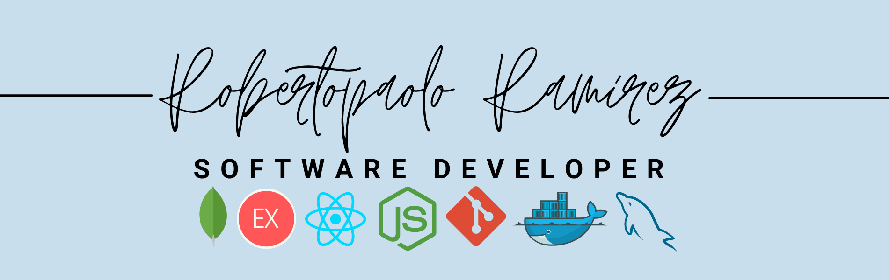

<h2> Hello everyone </h2>

 

My name is Roberto Ramirez! I'm from Peru, but I have been in Brazil for 5 years. Through my wife's influence, I learned how to make my first lines of code and I believe I can't stop programming. I love to learn, talk and listen to! So if you have anything you would like to recommend or would like to learn from me, I have open arms!

<h4> Languages and Tools: </h4>

<code></code>
<code></code>
<code></code>
<code></code>
<code></code>
<code></code>
<code></code>
<code></code>
<code></code>
<code></code>
<code></code>

<h3> About me</h3>

*  I'm from Peru, but I live in Brazil.
*  My favorite programming language is Javascript, but I don't close the doors to other languages or tools!
*  I got into the job market as a Spanish language teacher, and then I created [spanholandia](https://www.instagram.com/spanholandia/)!.

*  Currently I'm using Arch Linux.
*  The book I'm currently reading: [Eloquent Javascript](https://eloquentjavascript.net/).

<h5 align="left">Connect with me:</h5>

### **My Github data**

* 📜 27 Public Repositories.

* 🔑 4 Private Repositories. 
 
 

<h3>Thanks!</h3>
